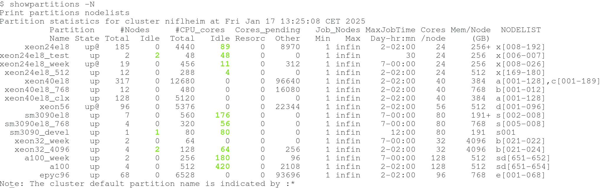

Slurm partition tools
---------------------

Tools for displaying Slurm partition information.

Author: Ole Holm Nielsen <Ole.H.Nielsen \at/ fysik.dtu.dk>

The "showpartitions" tool
-------------------------

Print a Slurm cluster partition status overview with 1 line per partition.
Color coding helps locating under- or over-utilized partitions.

This is really useful for users who want to find out which partitions are lightly or heavily loaded,
so that they can easily select a partition which will run their jobs sooner.
System administrators can get a quick overview of the system load.

Usage
-----

```
Usage: showpartitions [-p partition-list] [-g] [-m] [-a|-P] [-f] [-h]
where:
	-p partition: Print only jobs in partition(s) <partition-list>
	-g: Print also GRES information
	-m: Print minimum and maximum values for memory and cores/node.
	-a|-P: Display information about all partitions including hidden ones.
	-f: Show all partitions from the federation if a member of one. Only Slurm 18.08 and newer.
	-h: Print this help information

```

Example output:




The ```Idle``` cores and nodes are those with a Slurm status of *Idle*,
and these are colored in ```Green``` if ```Cores_pending:Resorc``` is zero.

The ```#Cores_pend``` (cores pending) in the ```Resorc``` column correspond to
*Pending* jobs with a Slurm job *Reason* flag of *Resources* or *Priority*,
whereas ```Other``` are pending for other reasons.
Cores are colored in ```Red``` if ```Cores_pending:Resorc``` is greater than zero.

Notice: Colored fields in the above output may possibly be a bit misleading in certain cases where some partitions are overlapping.

Some Slurm flags shown in the ```Partition``` columns are:

1. A \* after the partition ```name``` identifies the default Slurm partition.
2. A @ after the partition ```state``` means that some nodes are pending a reboot.
3. A $ after the partition ```state``` means that some nodes are in maintenance mode.
4. An R after the partition ```name``` identifies a root-only Slurm partition.
5. An H after the partition ```name``` identifies a hidden Slurm partition.

History
-------

The ```showpartitions``` tool was inspired by the excellent tool ```spart```, see https://github.com/mercanca/spart,
and has more or less the same functionality.

The "showhidden" tool
---------------------

Print a Slurm cluster partition status for hidden and root-only partitions.
This information is not easily accessible using the ```sinfo``` command.

Usage
-----

```
Usage: showhidden [sinfo-options]
```
The ```[sinfo-options]``` are passed to the ```sinfo``` command.
