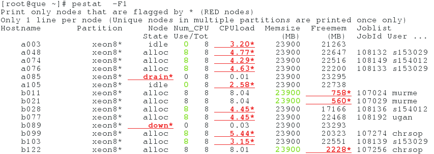

The Slurm tool "pestat" (Processor Element status)
--------------------------------------------------

Print Slurm nodes status with 1 line per node including job info.

Author: Ole Holm Nielsen <Ole.H.Nielsen \at/ fysik.dtu.dk>

Usage
-----

```
Usage: pestat [-p partition(s)] [-P] [-u username] [-g groupname] [-a accountname]
        [-q qoslist] [-s statelist] [-n/-w hostlist] [-j joblist] [-G] [-N]
        [-f | -F | -m free_mem | -M free_mem ] [-1|-2] [-d] [-E] [-C|-c] [-V] [-h]
where:
        -p partition: Select only partion <partition>
        -P: Include all partitions, including hidden and unavailable ones
        -u username: Print only jobs of a single user <username>
        -g groupname: Print only users in UNIX group <groupname>
	-a accountname: Print only jobs in Slurm account <accountname>
        -q qoslist: Print only QOS in the qoslist <qoslist>
        -R reservationlist: Print only node reservations <reservationlist>
        -s statelist: Print only nodes with state in <statelist>
        -n/-w hostlist: Print only nodes in hostlist
        -j joblist: Print only nodes in job <joblist>
        -G: Print GRES/GPU (Generic Resources for GPUs) in addition to JobId
        -N: Print JobName in addition to JobId
        -f: Print only nodes that are flagged by * (unexpected load etc.)
        -F: Like -f, but only nodes flagged in RED are printed.
        -m free_mem: Print only nodes with free memory LESS than free_mem MB
        -M free_mem: Print only nodes with free memory GREATER than free_mem MB (under-utilized)
        -d: Omit nodes with states: down drain drng resv maint boot
        -1: Default: Only 1 line per node (unique nodes in multiple partitions are printed once only)
        -2: 2..N lines per node which participates in multiple partitions
        -S: Job StartTime is printed after each jobid/user
        -E: Job EndTime is printed after each jobid/user.
            Hint: Pipe output with "pestat -E | sort -k 11" to sort the EndTimes.
        -T: Job TimeUsed is printed after each jobid/user
        -C: Color output is forced ON
        -c: Color output is forced OFF
        -h: Print this help information
        -V: Version information
```

Notice: This version of pestat uses ```squeue -O``` flags to list jobs, and this may not work correctly for Slurm 19.05 and older.

Example output
--------------



If there are any running array jobs, the JobID column will be shown as ```JobID(JobArrayID)```.
If a JobID is a member of a job array, the (JobArrayID) is shown after JobID.

Installation
------------

Copy pestat to a directory in the PATH:

```
wget https://raw.githubusercontent.com/OleHolmNielsen/Slurm_tools/master/pestat/pestat
chmod 755 pestat
cp pestat /usr/local/bin
```

If installing as a normal user, copy to the ~/bin for example:

```
cp pestat ~/bin
```

If desired copy pestat.conf:

```
wget https://raw.githubusercontent.com/OleHolmNielsen/Slurm_tools/master/pestat/pestat.conf
cp pestat.conf /etc/
```

Edit pestat.conf according to your needs.
Users may copy and edit this file as ```$HOME/.pestat.conf```.

Configuration
-------------

Some Environment configuration lines lines near the top of pestat may need to be changed for your environment, for example:

```
# Directory where Slurm commands live:
export prefix=/usr/bin
```

The global configuration file for pestat: ```/etc/pestat.conf```

Per-user configuration file for pestat: ```$HOME/.pestat.conf```

It is strongly recommended that you do not change the pestat script itself,
but make changes only in the above mentioned configuration files for pestat
to suit your needs.

Please write to the author if additional configurations should be made possible.

History
-------

The pestat tool was inspired by a similar tool for Torque/PBS by David Singleton (Sep 23, 2004),
see https://github.com/abarbu/torque/blob/master/contrib/README.pestat

The present author later (in 2007) wrote a pestat bash script for Torque, see https://github.com/OleHolmNielsen/Torque_tools

